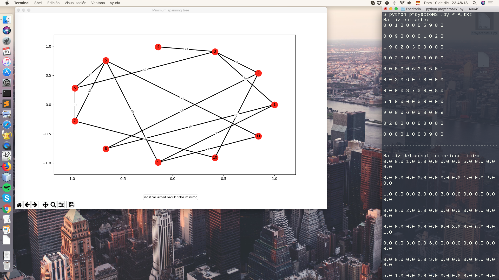
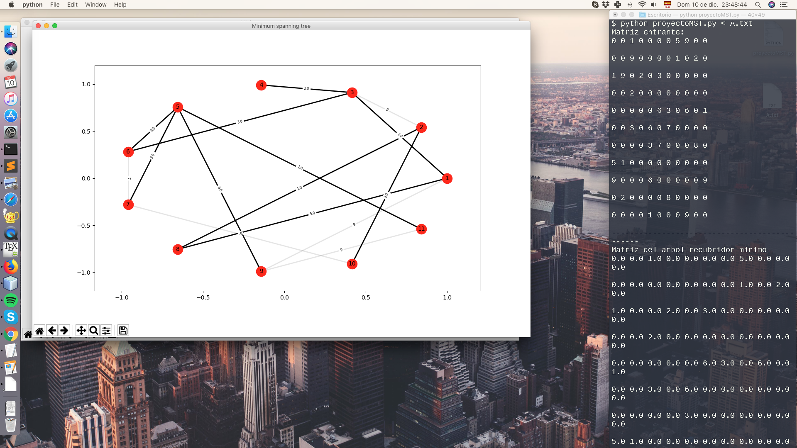

# Minimum Spanning Tree

This project was made for the discrete mathematics II course 2017 at the Universidad del Valle, Colombia.

This is a simple application that draws the minimum spanning tree using the [Kruskal's algorithm](https://en.wikipedia.org/wiki/Kruskal%27s_algorithm) according to an entered adjacency matrix.

Python - Numpy - Matplotlib  - NetworkX 

### Example screeshots:

#### Test 1.a

#### Test 1.b

